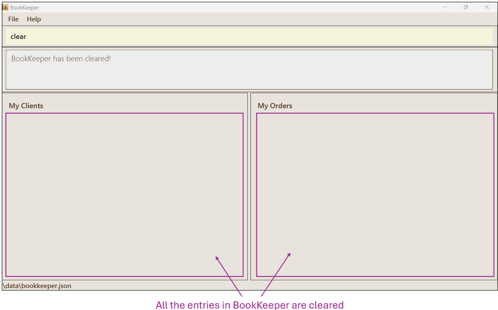
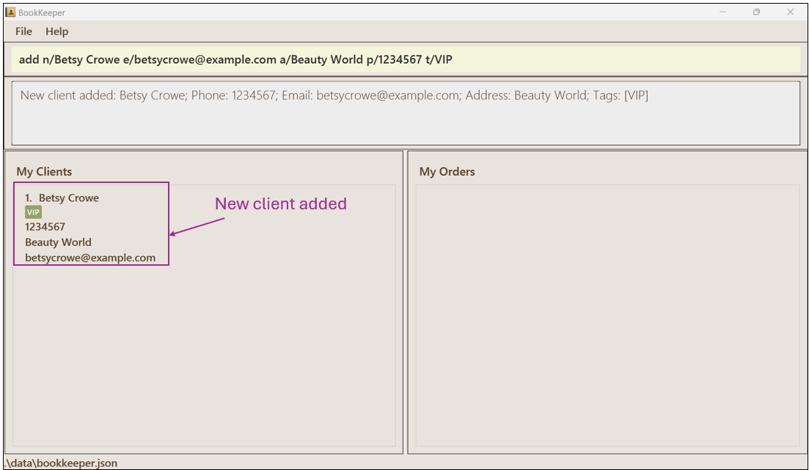
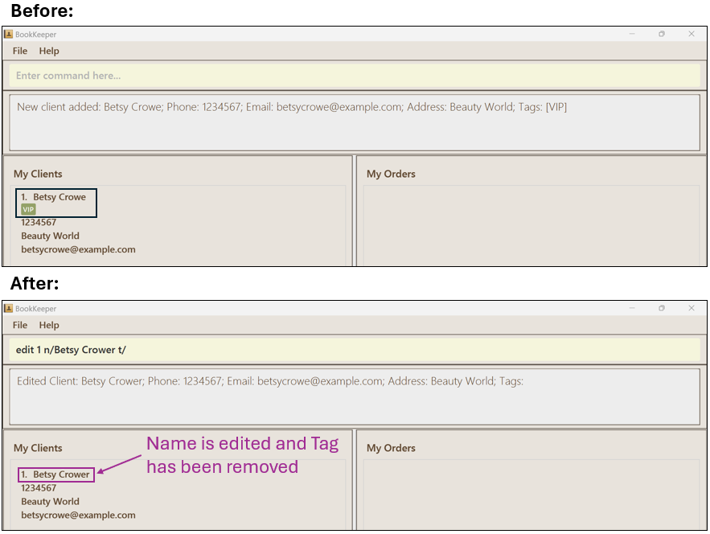
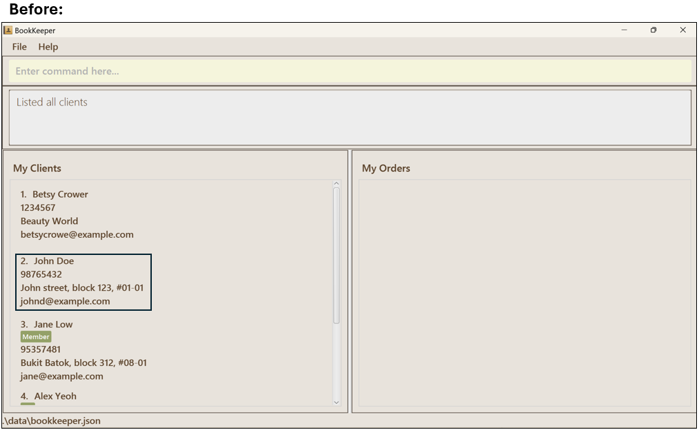
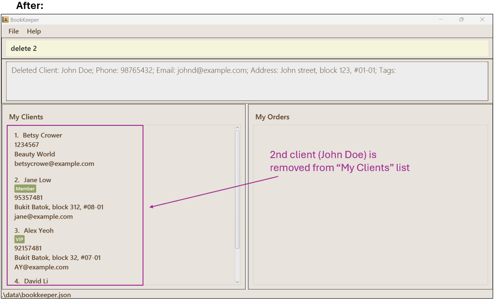
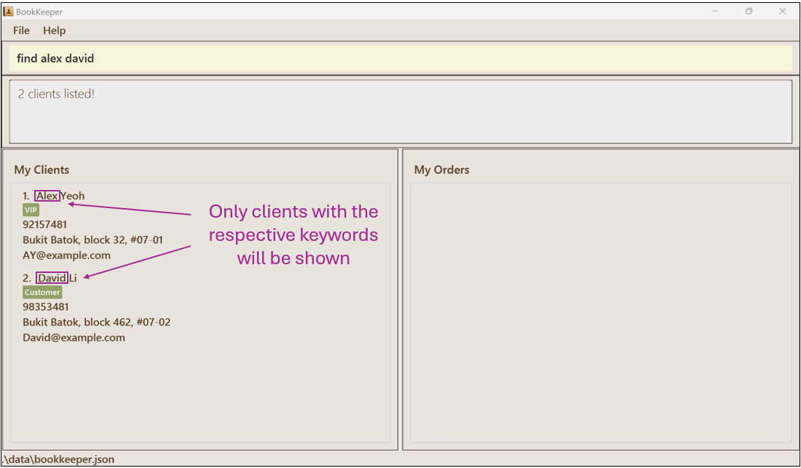
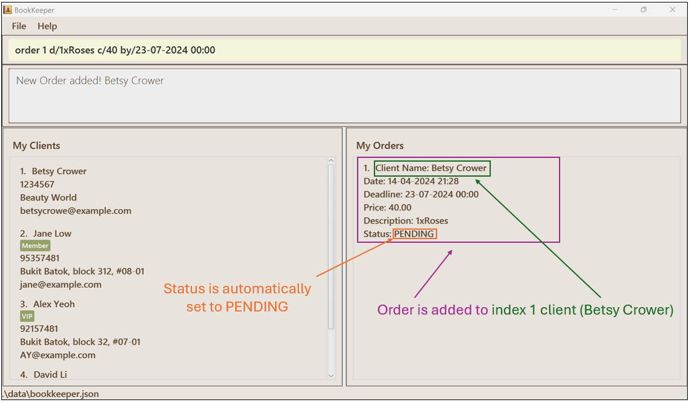
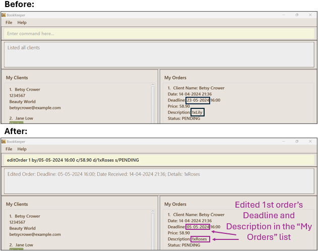
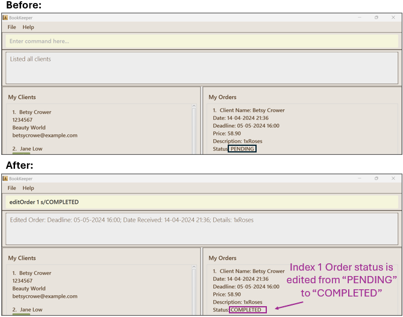

## Table of Contents

[1. Introduction](#1-introduction)

* [1.1. Introducing BookKeeper](#11-introducing-bookkeeper)
* [1.2. What's New in BookKeeper release v1.4](#12-whats-new-in-bookkeeper-release-v14)
* [1.3. Product Description](#13-product-description)
* [1.4. Unique Selling Points](#14-unique-selling-points)
    * [1.4.1. Centralised Platform](#141-centralised-platform)
    * [1.4.2. Efficiency](#142-efficiency)
    * [1.4.3. Tailored for Florist Businesses](#143-tailored-for-florist-businesses)
    * [1.4.4. Cost-Effective](#144-cost-effective)

[2. Target Audience with assumptions](#2-target-audience-with-assumptions)

* [2.1. Target Audience](#21-target-audience)
* [2.2. Assumptions](#22-assumptions)

[3. Quick start](#3-quick-start)

[4. Commands](#4-commands)

* [4.1 Command summary](#41-command-summary)
    * [4.1.1 Client](#411-client)
    * [4.1.2 Order](#412-order)

[5. Main Features](#5-main-features)

* [5.1. Help](#51-viewing-help--help)
* [5.2. Clear all entries](#52-clearing-all-entries--clear)
* [5.3. Exit the program](#53-exiting-the-program--exit)
* [5.4. Add a client](#54-adding-a-client-add)
* [5.5. Edit a client](#55-editing-a-client--edit)
* [5.6. Delete a client](#56-deleting-a-client--delete)
* [5.7. List all clients](#57-listing-all-clients--list)
* [5.8. Find clients by name](#58-locating-clients-by-name-find)
* [5.9. Add an order](#59-adding-an-order-order)
* [5.10. Delete an order](#510-deleting-an-order-deleteorder)
* [5.11. Edit an order](#511-editing-an-order--editorder)

[6. Known issues](#6-known-issues)

[Appendix A: Technical Glossary](#appendix-a-technical-glossary)

[Appendix B: FAQ](#appendix-b-faq)

[Appendix C: Planned Features](#appendix-c-planned-features)

--------------------------------------------------------------------------------------------------------------------

## 1. Introduction

### 1.1. Introducing BookKeeper

Welcome to BookKeeper — the user-friendly desktop app designed specifically for you, an aspiring florist ready to take
on the fast-paced world of the floristry business. You’ve decided on selling flower bouquets, and are looking for cheap
and efficient ways to bring your business to the next level.

BookKeeper helps you manage your clients and orders. We have designed this application with your needs in mind, and we
hope to make managing your business a breeze.

Our user guide will be your go-to resource to master Bookkeeper's different features. Inside, you will find detailed
explanations of our different features. Whether you are a greenhorn or an experienced practitioner, our guide has you
covered.

This guide is broken down into 5 main sections,

* Introduction (this)
* Quick Start
* Command Details
* Command Cheat Sheet
* FAQ and Glossary

Got questions? Check out the Frequently Asked Questions (FAQ) for quick answers to the common queries we receive.
Thank you for choosing BookKeeper! Without further ado, let us jump right into the guide.

### 1.2. What's New in BookKeeper release v1.4

BookKeeper v1.4 contains the following new features and improvements.

* Order management enhancements
    * Improved functionalities for efficient order management, with features like add, delete and edit orders.
* Link Client to Orders
    * Seamlessly links clients to their respective orders for comprehensive tracking and management
* Provides bug fixes
    * Fixed minor bugs to ensure the smooth operation of the application

### 1.3. Product Description

BookKeeper is like an address book, providing a working platform that can effectively manage user information
and orders. This efficiently manages customer relationships as it maximises user productivity.

### 1.4. Unique Selling Points

#### 1.4.1. Centralised Platform

BookKeeper offers a centralised platform where you can effortlessly store and search for client information,
keeping all your vital data organised and accessible at your fingertips.

#### 1.4.2. Efficiency

With its intuitive command-line interface, BookKeeper is faster and more efficient than traditional methods
like CRMs or Excel sheets. Spend less time navigating complex menus and more time serving your customer’s needs.

#### 1.4.3. Tailored for Florist Businesses

We understand the unique needs of florists, which is why BookKeeper comes equipped with customizable fields, tags,
and seamless integration with e-commerce platforms.

#### 1.4.4. Cost-Effective

Designed with small businesses in mind, BookKeeper is not only powerful but also cost-effective.
Say goodbye to expensive software solutions that drain your resources.

## 2. Target Audience with assumptions

### 2.1. Target Audience

BookKeeper is specifically designed for small florist businesses, catering to the unique needs and challenges they face
in managing client relationships and orders. Our target audience includes small florist shops, independent floral
designers, and boutique flower businesses.

### 2.2. Assumptions

1. Our application is made with the assumption that users are members of the florist industry and will understand the
   needs as well as the terminology used by florists. They can either be business owners, managers, or employees and
   are looking for a tailored solution to streamline their operations.
2. Users are presumed to have a basic understanding of computer operations and software usage. This can help them to
   navigate easily through the application and follow the instructions to download and use BookKeeper,
   as provided in this guide.
3. While prior experience with customer relationship management (CRM) systems and command line interfaces (CLIs) can
   help users to familiarise themselves with BookKeeper fast, BookKeeper is also entry-level-friendly so that we can
   accommodate users of all levels of technical expertise.

## 3. Quick start

1. Ensure you have Java `11` and above installed in your system.
    * You may check if you have Java installed by opening your command prompt or terminal, and type:  
      `java --version`
        * If Java is installed, you should ensure that it is currently running on version "11.x.xx".
        * 
            * If you encounter an error, or if your version does not match our specified requirements, you may visit the
              [Official Oracle website](https://www.oracle.com/java/technologies/javase/jdk11-archive-downloads.html) to
              download the Java JDK required to run this project.

2. Download the latest `bookkeeper.jar` release from [here](https://github.com/AY2324S2-CS2103T-T09-2/tp/releases).

3. Copy the file to the folder you want to use as the _home folder_ for your BookKeeper.

4. Open your terminal or command prompt in your system.

5. `cd` into the folder you put the jar file in, and use the `java -jar bookkeeper.jar`
   command to run the application. 
   A GUI similar to the below should appear in a few seconds. Note how the app contains some sample data. 
   

6. Type the command in the command box and press Enter to execute it. e.g. typing **`help`** and pressing Enter will
   open the help window. 
   Some example commands you can try:
    * Listing all contacts:
        * Command: `list`
    * Adding a new Client:
        * Command `add n/John Doe p/98765432 e/johnd@example.com a/John street, block 123, #01-01`
        * Adds a new `client` named `John Doe` to BookKeeper.
    * Adding a new Order:
        * Command `order 1 d/1xRoses c/20.99 by/20-10-2030 10:00`
        * Adds a new `order` for 1 Rose, at $20.99 that is to be delivered by 20-10-2030 10:00.
    * Delete an existing Client.
        * Command `delete 1`
        * Deletes the `client` with an index of 1.
    * Clear BookKeeper
        * Command `clear`
        * Clears all clients and orders.
    * Exit
        * Command `exit`
        * Closes the application.

7. Refer to the [Main Features](#6-main-features) below for details of each command.

## 4. Commands

### 4.1 Command summary

### 4.1.1 Client

| Action     | Format, Examples                                                                                                                                                  |
|------------|-------------------------------------------------------------------------------------------------------------------------------------------------------------------|
| **Add**    | `add n/NAME p/PHONE_NUMBER e/EMAIL a/ADDRESS [t/TAG]…​`   e.g., `add n/James Ho p/22224444 e/jamesho@example.com a/123, Clementi Rd, 1234665 t/VIP t/Customer` |
| **Clear**  | `clear`                                                                                                                                                           |
| **Delete** | `delete INDEX`  e.g., `delete 3`                                                                                                                               |
| **Edit**   | `edit INDEX [n/NAME] [p/PHONE_NUMBER] [e/EMAIL] [a/ADDRESS] [t/TAG]…​`  e.g.,`edit 2 n/James Lee e/jameslee@example.com`                                       |
| **Find**   | `find KEYWORD [MORE_KEYWORDS]`  e.g., `find James Jake`                                                                                                        |
| **List**   | `list`                                                                                                                                                            |
| **Help**   | `help`                                                                                                                                                            |

### 4.1.2 Order

| Action          | Format, Examples                                                                                                                     |
|-----------------|--------------------------------------------------------------------------------------------------------------------------------------|
| **order**       | `order INDEX by/DEADLINE c/PRICE d/DESCRIPTION`   e.g., `order 3 by/23-07-2024 00:00 c/99.99 d/1xRoses`                           |
| **deleteOrder** | `deleteOrder INDEX`   e.g., `deleteOrder 3`                                                                                      |
| **editOrder**   | `editOrder INDEX by/DEADLINE c/PRICE d/DESCRIPTION s/STATUS`   e.g., `editOrder 1 by/23-07-2024 10:10 c/40 d/1xRoses s/COMPLETED` |

## 5. Main Features

**:information_source: Notes about the command format:** 

* Words in `UPPER_CASE` are the parameters to be supplied by the user. 
  e.g. in `add n/NAME`, `NAME` is a parameter which can be used as `add n/John Doe`.

* Items in square brackets are optional. 
  e.g `n/NAME [t/TAG]` can be used as `n/John Doe t/friend` or as `n/John Doe`.

* Items with `…`​ after them can be used multiple times including zero times. 
  e.g. `[t/TAG]…​` can be used as ` ` (i.e. 0 times), `t/VIP`, `t/VIP t/MEMBER` etc.

* Parameters can be in any order. 
  e.g. if the command specifies `n/NAME p/PHONE_NUMBER`, `p/PHONE_NUMBER n/NAME` is also acceptable.

* Names are case-sensitive. 
  e.g. the names `John Doe` and `John doe` are considered unique.

* Extraneous parameters for commands that do not take in parameters (such as `help`, `list`, `exit` and `clear`) will be
  ignored. 
  e.g. if the command specifies `help 123`, it will be interpreted as `help`.

* If you are using a PDF version of this document, be careful when copying and pasting commands that span multiple lines
  as space characters surrounding line-breaks may be omitted when copied over to the application.

* All index inputs in commands labelled (INDEX) can omit any leading 0s. (e.g. 1, 01, 000001 are all valid index inputs
  for the index #000001)

### 5.1. Viewing help : `help`

Shows a message explaining how to access the help page.

Format: `help`

**:information_source: Additional Notes:** 

* You can press `F1` on your keyboard to access the Help page too.

### 5.2. Clearing all entries : `clear`

Clears all entries from BookKeeper.  
Format: `clear`  

### 5.3. Exiting the program : `exit`

Exits the program.  
Format: `exit`

### 5.4. Adding a client: `add`

Adds a client to BookKeeper.  
Format: `add n/NAME p/PHONE_NUMBER e/EMAIL a/ADDRESS [t/TAG]…​`

**:information_source: Additional Notes:** 

* Name must be unique, clients with exact same name is not allowed.
* A client can have any number of tags (including 0).
* Tags do not accept whitespaces (e.g. "VIP 2" is not accepted, "VIP2" is accepted).
* Name and Tags only accept 0-9 and a-z (case-insensitive).
* Phone number must be numeric and at least 3 numbers. It must not contain spaces " ", "brackets ()" or "hyphens -",
  "plus +" , or other symbols.
* Emails must not have consecutive special characters. E.g. "john..doe@example.com" is not accepted.

Example:
`add n/Betsy Crowe e/betsycrowe@example.com a/Beauty World p/1234567 t/VIP`

More examples:

* `add n/John Doe p/98765432 e/johnd@example.com a/John street, block 123, #01-01`
* `add n/Jane Low p/95357481 e/jane@example.com a/Bukit Batok, block 312, #08-01 t/Member`
* `add n/Alex Yeoh p/92157481 e/AY@example.com a/Bukit Batok, block 32, #07-01 t/VIP`
* `add n/David Li p/98353481 e/David@example.com a/Bukit Batok, block 462, #07-02 t/Customer`

### 5.5. Editing a client : `edit`

Edits an existing client in BookKeeper.  
Format: `edit INDEX [n/NAME] [p/PHONE] [e/EMAIL] [a/ADDRESS] [t/TAG]…​`

**:information_source: Additional Notes:** 

* Edits the client at the specified `INDEX`. The index refers to the index number shown in the displayed client list.
  The index **must be a positive integer** 1, 2, 3, …​
* At least one of the optional fields must be provided.
* Existing values will be updated to the input values.
* When editing tags, the existing tags of the client will be removed i.e adding of tags is not cumulative.
* You can remove all the client’s tags by typing `t/` without
  specifying any tags after it.
* tags do not accept whitespaces (e.g. "VIP 2" is not accepted, "VIP2" is accepted)
* tags only accept 0-9 and a-z (case-insensitive)

Example:
`edit 1 n/Betsy Crower t/` Edits the name of the 1st client to be `Betsy Crower` and clears all existing tags.

More examples:

`edit 2 p/91234567 e/johndoe@example.com` Edits the phone number and email address of the 2nd client to
be `91234567` and `johndoe@example.com` respectively.

### 5.6. Deleting a client : `delete`

Deletes the specified client from BookKeeper.  
Format: `delete INDEX`

**:information_source: Additional Notes:** 

* Deletes the client at the specified `INDEX`.
* The index refers to the index number shown in the displayed client list.
* The index **must be a positive integer** 1, 2, 3, …​

Example:

* `list` followed by `delete 2` deletes the 2nd client in BookKeeper.

More examples:

* `find Betsy` followed by `delete 1` deletes the 1st client in the results of the `find` command.

### 5.7. Listing all clients : `list`

Shows a list of all clients in BookKeeper.  
Format: `list`  

### 5.8. Locating clients by name: `find`

Finds clients whose names contain any of the given keywords.  
Format: `find KEYWORD [MORE_KEYWORDS]`

**:information_source: Additional Notes:** 

* The search is case-insensitive. e.g `hans` will match `Hans`
* The order of the keywords does not matter. e.g. `Hans Bo` will match `Bo Hans`
* Only the name is searched.
* Only full words will be matched e.g. `Han` will not match `Hans`
* Clients matching at least one keyword will be returned (i.e. `OR` search).
  e.g. `Hans Bo` will return `Hans Gruber`, `Bo Yang`

Example:

* `find alex david` returns `Alex Yeoh`, `David Li`

More examples:

* `find John` returns `john` and `John Doe`

### 5.9. Adding an order: `order`

Adds an order into BookKeeper.  
Format: `order <INDEX> by/DEADLINE c/PRICE d/DESCRIPTION`

**:information_source: Additional Notes:** 

* Adds the order to the client at the specified `INDEX`.
  The index **must be a positive integer** 1, 2, 3, …​, and the index must exist in the Client list.
* All fields must be provided.
* order of the fields does not matter
  (e.g. both `order <INDEX> by/DEADLINE c/PRICE d/DESCRIPTION` and `order <INDEX> d/DESCRIPTION c/PRICE by/DEADLINE`
  are acceptable)
* All orders status are automatically set to PENDING.
* Please specify `by/DEADLINE` field in `DD-MM-YYYY HH:MM`.
    * Deadlines can be set to a date before their current date to suggest that the order is overdue.
      (e.g. If your order was due yesterday, but you never make yet, you can also add a new order and put yesterday's
      day
      to track if you have orders that are overdue.)
* For the `c/PRICE` field, do note that any decimal places after 2 will be rounded up.
    * For e.g. `2.999` will be rounded up to `3.00`.
* The order list will be sorted according to their deadline.
    * Meaning, if there are two orders, one due on `10-10-2025 10:00` and another due on `10-10-2025 10:30`, the order
      with
      the deadline of `10-10-2025 10:00` will have an index of `1`, and the other order will have an index of `2`.

Examples:

* `order 1 d/1xRoses c/40 by/23-07-2024 00:00`

More examples:

* `order 3 by/07-07-2024 00:00 c/88.88 d/99xRoses`
* `order 1 by/23-05-2024 16:00 c/58.90 d/1xLily`

### 5.10. Deleting an order: `deleteOrder`

Deletes the specified order from BookKeeper.  
Format: `deleteOrder INDEX`

**:information_source: Additional Notes:**

* Deletes the order at the specified `INDEX`.
* The index refers to the index number shown in the displayed order list.
* The index **must be a positive integer** 1, 2, 3, …​

Examples:

* `deleteOrder 2` deletes the 2nd order in the order list.

### 5.11. Editing an order : `editOrder`

Edits an existing order in BookKeeper.  
Format: `editOrder <INDEX> [by/DEADLINE] [c/PRICE] [d/DESCRIPTION] [s/STATUS]`

**:information_source: Additional Notes:**

* Edits the order at the specified `INDEX`.
  The index **must be a positive integer** 1, 2, 3, …​
* Command can work without any optional fields provided.
* Existing values will be updated to the input values.
* There are 3 different status (they are all case-insensitive):

| Status        | Information                                   |
|---------------|-----------------------------------------------|
| **PENDING**   | `All orders are automatically set to PENDING` |
| **COMPLETED** | `When the order is delivered successfully`    |
| **CANCELED**  | `When the order is canceled`                  |

Examples:

1. `editOrder 1  by/05-05-2024 16:00 c/58.90 d/1xRoses s/PENDING` edits 1st order Deadline and Description in the order
   list.

2. `editOrder 1  s/COMPLETED` edits 1st order status to "COMPLETED".

### Saving the data

BookKeeper data are saved in the hard disk automatically after any command that changes the data. There is no need to
save manually.

### Editing the data file

BookKeeper data are saved automatically as a JSON file `[JAR file location]/data/bookkeeper.json`. Advanced users are
welcome to update data directly by editing that data file.

:exclamation: **Caution:**
If your changes to the data file makes its format invalid, BookKeeper will discard all data and start with an empty data file at the next run. Hence, it is recommended to take a backup of the file before editing it. 
Furthermore, certain edits can cause the BookKeeper to behave in unexpected ways (e.g., if a value entered is outside of the acceptable range). Therefore, edit the data file only if you are confident that you can update it correctly.

## 6. Known issues

1. **When using multiple screens**, if you move the application to a secondary screen, and later switch to using only
   the primary screen, the GUI will open off-screen. The remedy is to delete the `preferences.json` file created by the
   application before running the application again.

## Appendix A: Technical Glossary

**Java** - the programming language that the application was written in,
as well as the process in which the application is run

**JSON (Javascript Object Notation)** - a file format used to store data which is understandable
for both end users and computers. BookKeeper stores its data inside bookkeeper.json.

**Command Line Interface (CLI)**

A user interface that allows users to interact with the computer software by typing commands into the console.
The CLI is one method which BookKeeper application can be launched

**CRM (Customer Relationship Management)** - a program that simplifies managing of clientele and their needs.

**GUI (Graphical User Interface)** - is a type of user interface that allows users to interact through buttons and text.

## Appendix B: FAQ

**Q**: I cannot run the application. 
**A**: Ensure you have Java `11` and above installed in your system.

* You may check if you have Java installed by opening your command prompt or terminal, and type:  
  `java --version`
* If Java is installed, you should ensure that it is currently running on version "11.x.xx".
* 
* If you encounter an error, or if your version does not match our specified requirements, you may visit the
  [Official Oracle website](https://www.oracle.com/java/technologies/javase/jdk11-archive-downloads.html) to
  download the Java JDK required to run this project.

**Q**: What command do I use to [...]. 
**A**: You can access the help page by clicking the Help button on the application.

**Q**: How do I back up and restore data? 
**A**: Your data is stored in the same directory you downloaded the application in.
In that directory, search for a directory called data. In that directory, it is called `bookkeeper.json`.
You may copy `bookkeeper.json` to another location to back it up,
and you may copy another `bookkeeper.json` to restore existing data.

**Q**: Can I access the application from multiple devices at once? 
**A**: Not at the moment. It is something that we are working on, though.

**Q**: Can I access this application without internet connection? 
**A**: BookKeeper is designed to work fully offline.

**Q**: The application is not working!!! 
**A**: Contact us at [here](https://github.com/AY2324S2-CS2103T-T09-2/tp/releases).

**Q**: How do I update my application? 
**A**: You may download the latest release [here](https://github.com/AY2324S2-CS2103T-T09-2/tp/releases).

## Appendix C: Planned Features

1. Enhanced Error Messaging
    * Implementing more specific error messages for the "edit" and "editOrder" functions to provide clearer guidance
      to users encountering issues.
2. Enhanced Error Messaging for Wrong Indices with Missing Fields
    * For the `edit` command, if the user fills in 0 fills but an invalid index, the error message is "At least one
      field to edit must be provided."
    * This will be changed to note the invalid index in the future.
3. Extended Tag Length and Error Refinement
    * Increase the maximum length of tags supported within the system, enabling users to provide more descriptive labels
      and organize content effectively.
4. Resolution Support
    * Expand resolution support to include additional screen resolutions such as 1280x720, catering to a broader range
      of devices and user preferences.
5. Allow filtering of orders based on displayed customers.
    * Allow users to filter orders based on the displayed customers, providing a more streamlined and efficient
      experience for users managing multiple clients.
6. Allow adding of multiple users with the same name.
    * Allow users to add multiple clients with the same name, enabling users to manage multiple clients with similar
      names more effectively.
7. Relax constraints on field data types
    * There are constraints on length of values that may prevent overly long fields from being displayed correctly.
        * E.g. do not input a name that is too long, as it may not be displayed correctly.
    * There a constraints on size of values due to the innate storage system. Numbers cannot be too large.
        * E.g. do not input an Order Price that is unrealistically large for flower orders e.g. 9 billion (
          9,000,000,000).
